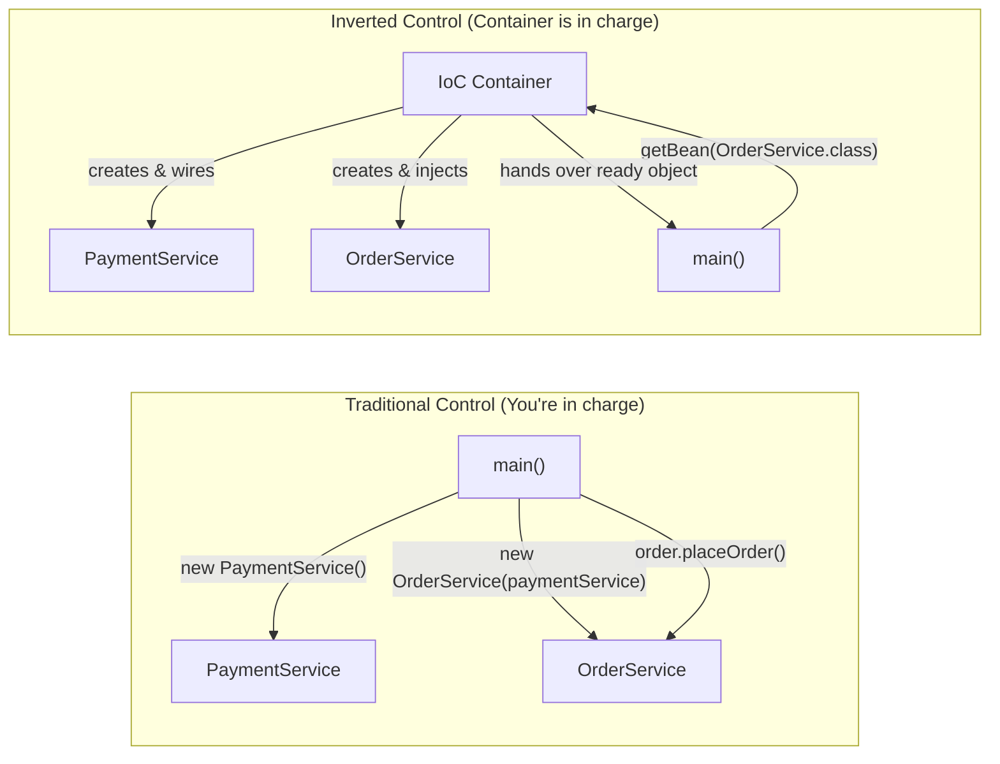
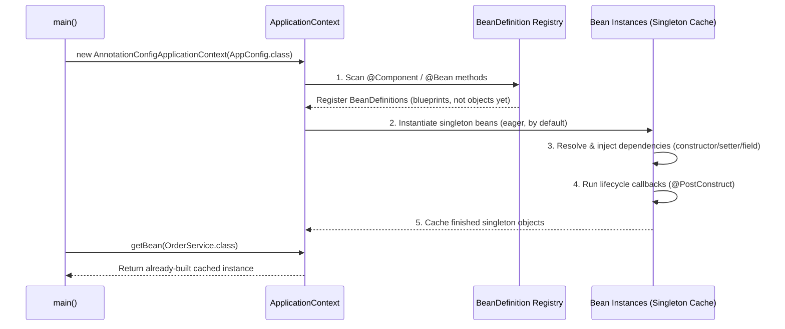
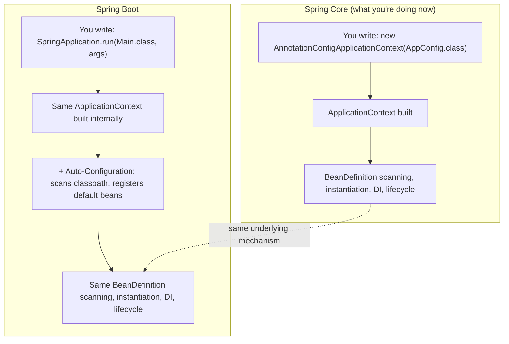
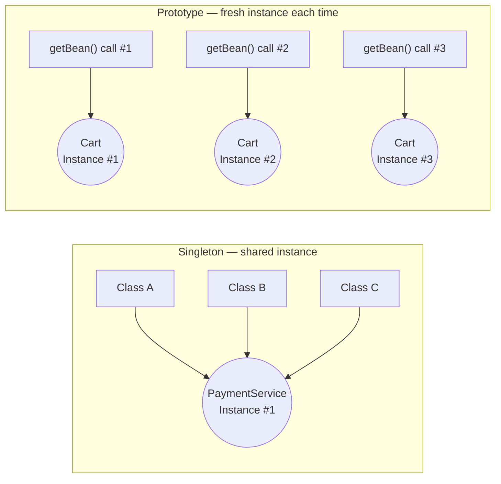
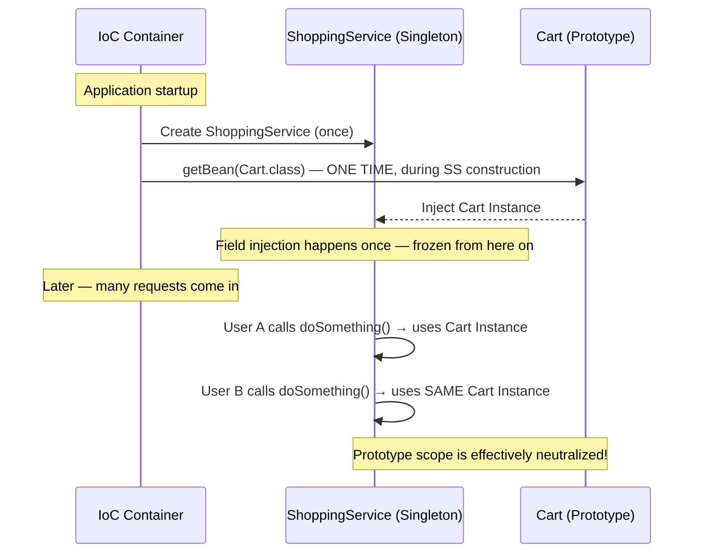
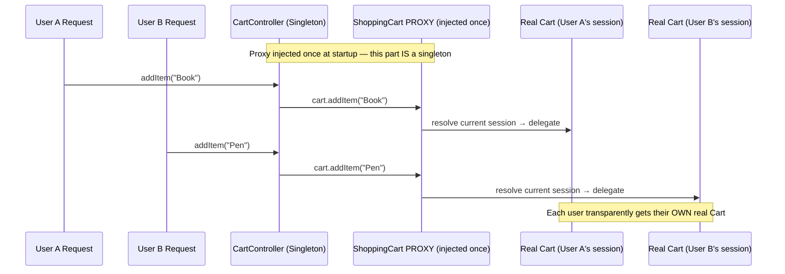
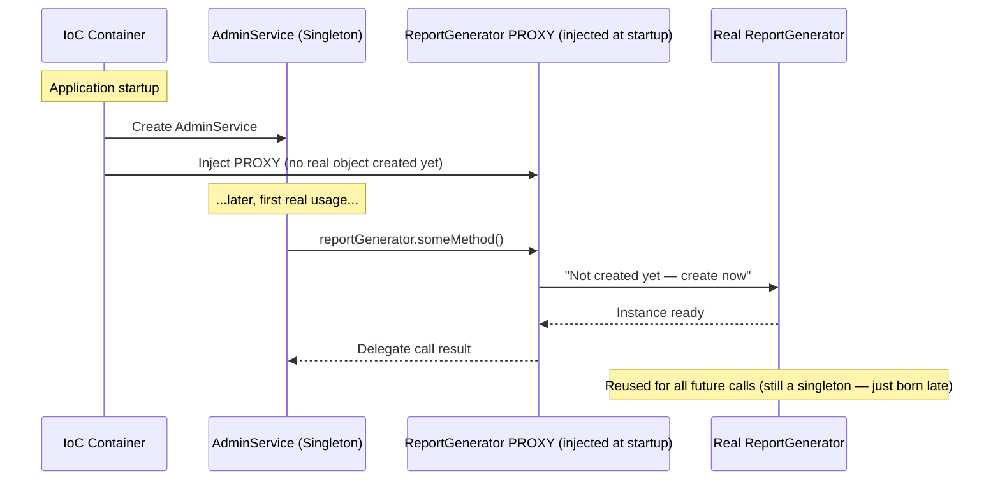
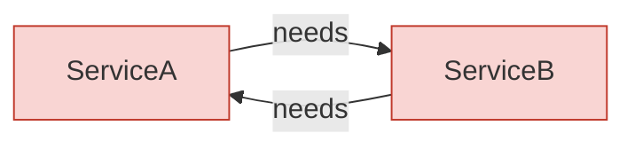
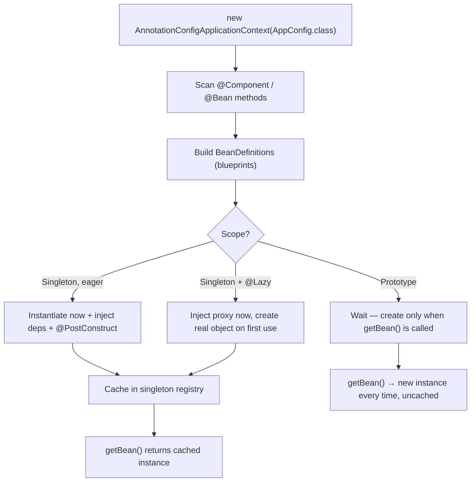

# 🌱 Spring IoC Container — From First Principles to Bean Scopes

> A deep-dive, learner-written reference on how the **Spring IoC Container** actually works under the hood — why it exists, how it builds objects, how scopes behave, and the gotchas that trip up almost everyone the first time.

This isn't a copy-paste of the official docs. It's a set of notes built by actually asking *"but why?"* at every step — starting from plain `new` keyword object creation, all the way to scoped proxies and circular dependency resolution.

---

## 📑 Table of Contents

1. [The Problem IoC Solves](#-1-the-problem-ioc-solves)
2. [What "Inversion of Control" Actually Means](#-2-what-inversion-of-control-actually-means)
3. [Dependency Injection — IoC's Main Technique](#-3-dependency-injection--iocs-main-technique)
4. [The Spring IoC Container — Step by Step](#-4-the-spring-ioc-container--step-by-step)
5. [BeanFactory vs ApplicationContext](#-5-beanfactory-vs-applicationcontext)
6. [Spring Core vs Spring Boot — What Actually Changes](#-6-spring-core-vs-spring-boot--what-actually-changes)
7. [Bean Scopes](#-7-bean-scopes)
   - [Singleton](#-singleton-the-default)
   - [Prototype](#-prototype)
   - [Scope Belongs to the Bean Definition, Not the Class](#-scope-belongs-to-the-bean-definition-not-the-class)
   - [The Singleton-Holding-a-Prototype Gotcha](#-the-singleton-holding-a-prototype-gotcha)
8. [Web-Aware Scopes: Request, Session, Application](#-8-web-aware-scopes-request-session-application)
9. [`@Lazy` Initialization](#-9-lazy-initialization)
10. [Global Lazy Initialization (`spring.main.lazy-initialization`)](#-10-global-lazy-initialization)
11. [Circular Dependencies](#-11-circular-dependencies)
12. [Resolving Ambiguity: `@Qualifier` and `@Primary`](#-12-resolving-ambiguity-qualifier-and-primary)
13. [Cheat Sheet & Mental Models](#-13-cheat-sheet--mental-models)
14. [Key Takeaways](#-14-key-takeaways)
15. [Glossary](#-15-glossary)

---

## 🎯 1. The Problem IoC Solves

Before any framework, object creation in Java is manual:

```java
public class OrderService {
    private PaymentService paymentService = new PaymentService();
    private InventoryService inventoryService = new InventoryService();

    public void placeOrder() {
        paymentService.charge();
        inventoryService.reserveStock();
    }
}
```

This looks harmless, but it **tightly couples** `OrderService` to specific concrete implementations. It creates real problems:

- You can't swap `PaymentService` for a mock/test double without editing `OrderService`.
- `OrderService` is doing two jobs: **creating objects** and **running business logic**. That's a violation of Single Responsibility.
- If `PaymentService` is expensive to create or should be shared, every class that `new`s it gets its own separate copy.

### The Core Principle

> A service should **not create** the objects it depends on. It should only **use** them and run business logic. Object creation is a separate concern.

The fix — pass dependencies in from outside, instead of creating them inside:

```java
public class OrderService {
    private final PaymentService paymentService;
    private final InventoryService inventoryService;

    public OrderService(PaymentService paymentService, InventoryService inventoryService) {
        this.paymentService = paymentService;
        this.inventoryService = inventoryService;
    }

    public void placeOrder() {
        paymentService.charge();
        inventoryService.reserveStock();
    }
}
```

You could even wire this manually in `main()`:

```java
PaymentService paymentService = new PaymentService();
InventoryService inventoryService = new InventoryService();
OrderService orderService = new OrderService(paymentService, inventoryService);
orderService.placeOrder();
```

This **is** real Dependency Injection — no Spring required. So the natural question is:

> **If manual wiring already works, why does Spring's IoC container need to exist at all?**

### Why Manual Wiring Breaks Down at Scale

| Problem | Why manual wiring struggles |
|---|---|
| **Large object graphs** | Real apps have hundreds of interdependent beans across many layers. Manually writing `new X(new Y(new Z(...)))` in the correct order becomes unmanageable. |
| **Singleton management** | If 5 different classes need the *same* `PaymentService` instance, you must carefully create it once and pass the same reference everywhere — easy to get wrong by hand. |
| **Swappable configuration** | Switching a mock implementation for a real one (e.g. for testing) means editing wiring code everywhere it's constructed. |
| **Lifecycle management** | Initialization hooks, destruction hooks, proxies for transactions/security — none of this exists for free with plain `new`. |
| **True loose coupling** | Even manual DI still requires the wiring code to know every concrete class. Spring can resolve dependencies by type/qualifier without that central knowledge. |

**For a 3–4 class toy app, manual DI is genuinely simpler** — some experienced developers deliberately use "Pure DI" for small projects. Spring's IoC container earns its complexity specifically **at scale**.

---

## 🔄 2. What "Inversion of Control" Actually Means

**Dependency Injection (DI) is a technique. IoC is the broader principle DI implements.**

- **Normal control flow:** *your code* decides when to create objects and controls the sequence of the program — `main()` calls `new OrderService()`, then calls `order.placeOrder()`.
- **Inverted control:** a **container/framework** takes over that responsibility. It decides when objects get created, how they're wired together, and even calls back into your code at the right moments (like lifecycle hooks).



This is why it's called "**inversion**" — the responsibility for object creation and wiring is flipped from your application code onto the framework.

---

## 💉 3. Dependency Injection — IoC's Main Technique

Spring implements IoC mainly through **Dependency Injection**: a class declares what it needs, and the container supplies it. There are three common styles:

| Style | Example | Notes |
|---|---|---|
| **Constructor Injection** | `public OrderService(PaymentService p) { ... }` | Preferred — makes dependencies explicit & final, easy to test. |
| **Setter Injection** | `public void setPaymentService(PaymentService p) { ... }` | Useful for optional dependencies. |
| **Field Injection** | `@Autowired private PaymentService paymentService;` | Most concise, but harder to unit test and hides required dependencies. |

---

## ⚙️ 4. The Spring IoC Container — Step by Step

Here's the raw Spring Core entry point:

```java
package org.example;

import org.springframework.context.ApplicationContext;
import org.springframework.context.annotation.AnnotationConfigApplicationContext;

public class Main {
    public static void main(String[] args) {
        ApplicationContext applicationContext =
                new AnnotationConfigApplicationContext(AppConfig.class);

        OrderService order = applicationContext.getBean(OrderService.class);
        order.placeOrder();
    }
}
```

`new AnnotationConfigApplicationContext(AppConfig.class)` is not a throwaway line — it **is** the act of bootstrapping the entire IoC container. Without it, `@Component` and `@Bean` annotations are just inert metadata that nothing reads.

### What happens, in order



1. **Scan configuration** — Spring reads `AppConfig`. If it has `@ComponentScan`, it scans the given packages for `@Component`, `@Service`, `@Repository`, `@Controller` classes. `@Bean`-annotated methods inside the config class are noted too.
2. **Build `BeanDefinition`s** — for every class/method found, Spring does **not** create the object yet. It creates a `BeanDefinition`: metadata describing the class, scope, dependencies, init/destroy methods. Think of this as a **blueprint**, not the actual object.
3. **Instantiate beans** — for singletons (the default), Spring eagerly creates the real objects at startup, resolving the dependency graph (including nested dependencies) as it goes.
4. **Inject dependencies** — once a dependency exists, Spring injects it via constructor, setter, or reflection on fields.
5. **Cache the finished beans** — completed singletons are stored in an internal map so `getBean()` is just a lookup, not a fresh construction.
6. **Run lifecycle callbacks** — any `@PostConstruct` methods run right after injection, before the bean is handed out.

> `getBean()` for a singleton doesn't create anything new — the container already built it in step 3. It's simply handing you a reference.

---

## 🏭 5. BeanFactory vs ApplicationContext

`ApplicationContext` is the interface used throughout this document, but it's worth knowing what it actually is:

- **`BeanFactory`** — the root interface of the IoC container. Provides the basic mechanics: bean definitions, dependency injection, lazy-by-default bean creation.
- **`ApplicationContext`** — extends `BeanFactory` and adds enterprise features on top: eager singleton instantiation by default, event publishing, internationalization support, and easier integration with annotation-based configuration (`AnnotationConfigApplicationContext`, `ClassPathXmlApplicationContext`, etc.).

In practice, almost every real Spring (and Spring Boot) application uses `ApplicationContext` — `BeanFactory` is mostly a low-level foundation you rarely touch directly.

---

## 🥾 6. Spring Core vs Spring Boot — What Actually Changes

A common point of confusion: *"If I can already do IoC with plain Spring, what does Boot actually add?"*

**Boot does not replace the IoC container. It automates bootstrapping and configuring it.**

| What you do manually in Core Spring | What Spring Boot automates |
|---|---|
| `new AnnotationConfigApplicationContext(AppConfig.class)` in `main()` | `@SpringBootApplication` + `SpringApplication.run(Main.class, args)` builds the same `ApplicationContext` internally — just hidden from view. |
| Explicit `@ComponentScan` | `@SpringBootApplication` includes `@ComponentScan` automatically, rooted at the main class's package. |
| Manually defining infra beans (`DataSource`, `RestTemplate`, embedded server) with `@Bean` methods | **Auto-configuration** — Boot inspects the classpath ("`spring-webmvc` is present → register an embedded Tomcat + `DispatcherServlet`") and registers sensible default beans automatically. |
| Manually reading config values | Boot auto-binds `application.properties` / `.yml` into beans via `@ConfigurationProperties` / `@Value`. |
| Running as a plain Java app + external server | Boot packages an executable JAR with an embedded server — no external deployment setup needed. |



> **The IoC mechanism you're learning right now — scanning, `BeanDefinition`s, dependency injection, singleton caching — is exactly what runs inside a Spring Boot app.** Boot just creates the context for you and pre-registers a lot of useful beans automatically. You're learning the engine; Boot just hides the ignition switch.

---

## 🎭 7. Bean Scopes

Scope answers one question: **"When someone asks the container for this bean, do they get the same instance every time, or a new one?"**

### 🔒 Singleton (the default)

**One instance per Spring container**, shared by everyone who asks for it.

```java
@Component
public class PaymentService { }
```

```java
PaymentService p1 = context.getBean(PaymentService.class);
PaymentService p2 = context.getBean(PaymentService.class);
System.out.println(p1 == p2); // true — same object
```

- Created **eagerly**, at container startup, by default.
- Cached in the container's internal registry — full lifecycle is managed by Spring (including `@PreDestroy` when the context closes).
- Ideal for **stateless** services/repositories/controllers — no per-user data, just logic + dependencies.

### 🧬 Prototype

**A new instance every time it's requested** from the container.

```java
@Component
@Scope("prototype")
public class ShoppingCart { }
```

```java
ShoppingCart c1 = context.getBean(ShoppingCart.class);
ShoppingCart c2 = context.getBean(ShoppingCart.class);
System.out.println(c1 == c2); // false — different objects
```

- Must be **explicitly declared** — there's no auto-detection; omit `@Scope("prototype")` and you silently get singleton.
- Created **lazily** — nothing happens until `getBean()` is actually called.



### Memory & Lifecycle — Singleton vs Prototype

| | Singleton | Prototype |
|---|---|---|
| **Created** | Once, at startup (eager) | Every time `getBean()` is called (lazy by nature) |
| **Who holds the reference** | The Spring container (in its internal cache) | Whoever called `getBean()` — your code |
| **Destroyed by** | Spring, when the context closes (`@PreDestroy` runs) | Nobody — plain Java garbage collection, once unreferenced |
| **Spring's involvement after creation** | Full lifecycle management | None — "create and forget" |

> **Key insight:** for a prototype bean, once `getBean()` hands it to you, **Spring forgets about it completely.** From that point on it's a regular Java object, subject to regular GC rules — nondeterministic cleanup, and `@PreDestroy` will **never** fire automatically on it.

### 🧩 Scope Belongs to the Bean Definition, Not the Class

An important nuance: scope is a property of the **`BeanDefinition` (the recipe)**, not of the Java **class** itself. Register the same class under two different bean definitions, and you get two entirely independent singletons.

```java
@Configuration
public class AppConfig {

    @Bean
    public PaymentService paymentServiceA() {
        return new PaymentService();
    }

    @Bean
    public PaymentService paymentServiceB() {
        return new PaymentService();
    }
}
```

```java
PaymentService a = context.getBean("paymentServiceA", PaymentService.class);
PaymentService b = context.getBean("paymentServiceB", PaymentService.class);
System.out.println(a == b); // false — two different objects!

PaymentService a1 = context.getBean("paymentServiceA", PaymentService.class);
PaymentService a2 = context.getBean("paymentServiceA", PaymentService.class);
System.out.println(a1 == a2); // true — same bean definition
```

> Think of `BeanDefinition` as a **recipe**, not the class itself. "Singleton" means *"for this specific recipe, build the object once and reuse it"* — not *"only one object of this Java type will ever exist in the container."*

### ⚠️ The Singleton-Holding-a-Prototype Gotcha

This is one of the most common Spring bugs for learners (and beyond). Consider:

```java
@Component // singleton by default
public class ShoppingService {

    @Autowired
    private Cart cart; // Cart is @Scope("prototype")
}
```



Since `ShoppingService` is a singleton, it's constructed **once** — and its `cart` field is injected **once**, at that moment. Every user/request that goes through this one `ShoppingService` instance ends up sharing the **same** `Cart` object, even though `Cart` was declared `prototype`. Dependency injection via `@Autowired` is a **wiring-time event**, not a **per-call event** — Spring doesn't re-inject on every method call.

#### Fixes — force the container to fetch fresh, at the moment of use

**1. Inject `ApplicationContext` directly (simple, but couples code to Spring):**
```java
@Component
public class ShoppingService {
    @Autowired
    private ApplicationContext context;

    public void doSomething() {
        Cart cart = context.getBean(Cart.class); // fresh every call
    }
}
```

**2. `ObjectProvider<T>` (cleaner, Spring-idiomatic):**
```java
@Component
public class ShoppingService {
    @Autowired
    private ObjectProvider<Cart> cartProvider;

    public void doSomething() {
        Cart cart = cartProvider.getObject(); // fresh every call
    }
}
```

**3. `@Lookup` method injection (Spring generates the "fetch fresh" logic via a proxy):**
```java
@Component
public abstract class ShoppingService {

    @Lookup
    public abstract Cart getCart(); // Spring overrides this at runtime

    public void doSomething() {
        Cart cart = getCart(); // fresh every call
    }
}
```

---

## 🌐 8. Web-Aware Scopes: Request, Session, Application

These scopes only exist in a **web-aware** `ApplicationContext` (Spring MVC / Boot web apps):

| Scope | Lifetime |
|---|---|
| **`request`** | One instance per single HTTP request — created on request start, destroyed on completion. |
| **`session`** | One instance per user's HTTP session — lives until logout/timeout. |
| **`application`** | One instance per `ServletContext` — effectively behaves like a singleton, scoped to the whole web app. |

### The Problem — same root cause as the prototype gotcha

Controllers are **singletons**, created once at startup. Naively injecting a `session`-scoped bean into a singleton controller **cannot work at all** with plain field injection — there's no "current session" available yet at application startup.

### The Fix: Scoped Proxies

Spring injects a **lightweight proxy** instead of the real object. The proxy looks and behaves like the real bean, but on every method call it checks the *current* request/session and delegates to the real bean for that specific context.

```java
@Component
@Scope(value = WebApplicationContext.SCOPE_SESSION, proxyMode = ScopedProxyMode.TARGET_CLASS)
public class ShoppingCart {
    // fields, methods
}
```



### Mental Model

| Scope | "Correct instance" determined by... | How it's resolved |
|---|---|---|
| **Prototype** | Every `getBean()` call | Manual — you call `getBean()` / `ObjectProvider` yourself each time |
| **Request** | The current HTTP request | Automatic — proxy checks the thread-bound request context |
| **Session** | The current user's session | Automatic — proxy checks the thread-bound session context |
| **Application** | The whole app (servlet context) | Effectively one instance always, like singleton |

> Request/session scope is really **prototype's core idea** (need a different instance per unit of work) **+ a proxy that automates** figuring out *which* instance to fetch, using the web context as the trigger instead of manual calls.

---

## 💤 9. `@Lazy` Initialization

By default, singleton beans are created **eagerly** at startup, whether used immediately or not. `@Lazy` defers that.

```java
@Component
@Lazy
public class ReportGenerator {
    public ReportGenerator() {
        System.out.println("ReportGenerator created!");
    }
}
```



1. `AdminService` (normal eager singleton) needs its `reportGenerator` field filled at startup.
2. Since `ReportGenerator` is `@Lazy`, Spring injects a **proxy**, not the real object.
3. The moment a real method is actually called, the proxy creates the real instance, delegates the call, and reuses that same real instance from then on.

> **`@Lazy` only delays *when* the one singleton instance is born — it does NOT turn a singleton into something that creates multiple instances.** Don't confuse it with prototype scope.

| | `@Lazy` (on a singleton) | Prototype |
|---|---|---|
| Real objects total | Still just **one** — created later | **Many** — new one every `getBean()` call |
| Proxy's job | Delay creation of the one instance until first use | N/A |
| After first creation | Same object reused forever (normal singleton behavior) | Every request produces a fresh object |

**Why use it:** defers expensive constructor work (loading large templates, opening connections) until actually needed, so it doesn't slow down app startup for a rarely-used bean.

---

## ⚡ 10. Global Lazy Initialization

```properties
spring.main.lazy-initialization=true
```

This flips the **default** for *every* bean in the app from eager to lazy, without annotating each class individually.

### Why it's generally discouraged in production

1. **Startup failures get deferred and hidden.** Normally, a misconfigured bean fails **fast at startup** — you find out immediately, before deployment finishes. With global lazy init, that same bean only fails on its **first real use**, possibly in production, possibly hitting a real user instead of your CI/CD pipeline.
2. **First-request latency spikes.** Whoever triggers a bean's first use pays its construction cost — a slower response for that particular request, especially for heavy beans.
3. **Masks real performance problems instead of fixing them.** If startup is slow because of one or two genuinely heavy beans, blanket lazy-init hides the symptom instead of surfacing the actual bottleneck.

### The recommended approach: targeted `@Lazy`

Apply `@Lazy` only to specific classes you've identified as heavy or rarely used:

```java
@Component
@Lazy
public class ExpensiveReportEngine {
    // heavy initialization, rarely used feature
}
```

> **Rule of thumb:** global `lazy-initialization=true` trades one visible problem (slow startup) for arguably worse, harder-to-debug ones (silent failures, unpredictable first-request latency). Reach for **targeted `@Lazy`** on a specific class you've profiled as heavy — not as a blanket production setting.

---

## 🔁 11. Circular Dependencies

```java
@Component
public class ServiceA {
    @Autowired
    private ServiceB serviceB;
}

@Component
public class ServiceB {
    @Autowired
    private ServiceA serviceA;
}
```



**The chicken-and-egg problem:** to fully build `ServiceA`, Spring needs a ready `ServiceB` — but to fully build `ServiceB`, Spring needs a ready `ServiceA`. Neither can finish first. By default this throws a `BeanCurrentlyInCreationException` at startup.

### `@Lazy` as an escape hatch

Marking one side `@Lazy` breaks the deadlock — Spring injects a **proxy** instead of demanding the fully-built real object immediately, so the other bean can finish constructing:

```java
@Component
public class ServiceA {
    @Autowired
    @Lazy
    private ServiceB serviceB; // proxy injected, breaks the startup deadlock
}
```

### ⚠️ This is a workaround — not a fix

`@Lazy` avoids the **symptom** (the startup crash). It does not resolve the **underlying design smell**: two classes are too tightly coupled, or responsibilities are split incorrectly. Real fixes:

- **Merge the two classes** if they're really one cohesive responsibility awkwardly split in two.
- **Extract shared logic into a third class** that both depend on, instead of depending on each other.
- **Restructure to make the dependency one-directional** — reconsider *why* B needs A when A already needs B.

> **Well-designed code shouldn't have circular dependencies in the first place.** `@Lazy` is an emergency escape hatch for when you're stuck with legacy code you can't restructure right now — not a pattern to rely on by default.

---

## 🎯 12. Resolving Ambiguity: `@Qualifier` and `@Primary`

If two beans of the **same type** exist in the container, `getBean(PaymentService.class)` — or `@Autowired` on a `PaymentService` field — becomes ambiguous. Spring doesn't know which one you mean and throws a `NoUniqueBeanDefinitionException`.

```java
@Component("razorpay")
public class RazorpayPaymentService implements PaymentService { }

@Component("stripe")
public class StripePaymentService implements PaymentService { }
```

### `@Qualifier` — be explicit about which bean you want

```java
@Component
public class OrderService {
    @Autowired
    @Qualifier("razorpay")
    private PaymentService paymentService; // explicitly picks the Razorpay bean
}
```

### `@Primary` — mark one bean as the default choice

```java
@Component
@Primary
public class RazorpayPaymentService implements PaymentService { }
```

With `@Primary`, plain `@Autowired private PaymentService paymentService;` resolves to the Razorpay bean automatically — no `@Qualifier` needed, *unless* you want to explicitly override the default somewhere with `@Qualifier`.

| | `@Qualifier` | `@Primary` |
|---|---|---|
| Where it's used | At each injection point where you need a *specific* bean | On the bean definition itself, as the app-wide default |
| Effect | Explicit choice, every time | Implicit default, unless explicitly overridden |
| Best for | Cases where different classes genuinely need different implementations | Cases where one implementation is "the normal choice" and exceptions are rare |

---

## 📋 13. Cheat Sheet & Mental Models

### Bean Creation Timing

| Scope | Created | Destroyed |
|---|---|---|
| Singleton | Eagerly, at startup | By Spring, on context close (`@PreDestroy`) |
| Singleton + `@Lazy` | On first real use | By Spring, on context close |
| Prototype | On every `getBean()` call | Never by Spring — plain Java GC |
| Request | Per HTTP request | End of request |
| Session | Per user session | Session timeout / logout |

### "Who resolves the correct instance, and when?"

| Mechanism | Resolves at... |
|---|---|
| Constructor/Field Injection | Wiring time (once, during singleton construction) |
| `ObjectProvider` / manual `getBean()` | Every time you call it |
| `@Lookup` | Every method call (Spring-generated override) |
| Scoped Proxy (`request`/`session`) | Every method call, based on current web context |

### Full Bootstrap → Runtime Flow



---

## ✅ 14. Key Takeaways

- **IoC is a principle; DI is Spring's main technique for implementing it.** The container takes over object creation, wiring, and lifecycle — you just declare what you need.
- **`ApplicationContext` is the explicit bootstrap point** in Core Spring. Spring Boot doesn't remove this step — it hides it inside `SpringApplication.run()` and adds auto-configuration on top.
- **Singleton = one shared instance per bean definition**, eagerly created and fully lifecycle-managed by Spring.
- **Prototype = a new instance every `getBean()` call**, lazily created, and *not* managed by Spring after handoff — plain Java GC takes over.
- **Scope is a property of the `BeanDefinition`, not the Java class** — the same class can have multiple independent singleton instances if registered as multiple bean definitions.
- **Injecting a prototype into a singleton via normal field/constructor injection only happens once** — use `ObjectProvider`, `@Lookup`, or manual `getBean()` calls to get a genuinely fresh instance per use.
- **Web scopes (`request`/`session`) solve the same problem as the prototype-in-singleton gotcha**, but automatically, via **scoped proxies** that resolve the current instance based on the active HTTP context.
- **`@Lazy` delays creation of a singleton — it does not create multiple instances.** Don't confuse it with prototype scope.
- **Global `lazy-initialization=true` is generally discouraged in production** — it hides startup failures and creates unpredictable first-request latency. Prefer targeted `@Lazy` on specific, identified heavy beans.
- **`@Lazy` can unblock circular dependencies, but it's a workaround, not a fix.** A real circular dependency is a design smell — fix it by merging responsibilities, extracting shared logic, or making the dependency one-directional.
- **`@Qualifier` and `@Primary` resolve ambiguity** when multiple beans of the same type exist — `@Qualifier` for explicit per-injection choice, `@Primary` for an app-wide default.

---

## 📖 15. Glossary

| Term | Meaning |
|---|---|
| **IoC (Inversion of Control)** | The principle that a framework, not your code, controls object creation and program flow. |
| **DI (Dependency Injection)** | The technique of supplying a class's dependencies from outside, instead of the class creating them itself. |
| **Bean** | An object managed by the Spring IoC container. |
| **`BeanDefinition`** | The container's internal metadata/blueprint describing how to build a bean — class, scope, dependencies, lifecycle hooks. Created before the actual object exists. |
| **`ApplicationContext`** | Spring's main IoC container interface — extends `BeanFactory` with eager singleton init, events, and more. |
| **`BeanFactory`** | The root, lower-level IoC container interface underlying `ApplicationContext`. |
| **Singleton Scope** | One shared bean instance per bean definition, for the lifetime of the container. |
| **Prototype Scope** | A brand-new bean instance every time it's requested. |
| **Scoped Proxy** | A stand-in object injected in place of the real bean, which resolves and delegates to the "correct" real instance at call-time (used for prototype-in-singleton fixes, and `request`/`session` scopes). |
| **`@PostConstruct`** | Lifecycle callback run right after a bean is constructed and injected. |
| **`@PreDestroy`** | Lifecycle callback run when a Spring-managed bean (typically singleton) is destroyed on context close. Never fires automatically on prototype beans. |
| **Auto-Configuration** | Spring Boot's mechanism for automatically registering default beans based on what's present on the classpath. |
| **Circular Dependency** | Two (or more) beans that depend on each other, creating a construction deadlock. |

---

<p align="center">
  <i>Built as a personal learning reference while studying Spring's IoC container — from raw <code>new</code> keyword object creation to scoped proxies and circular dependency resolution.</i>
</p>
